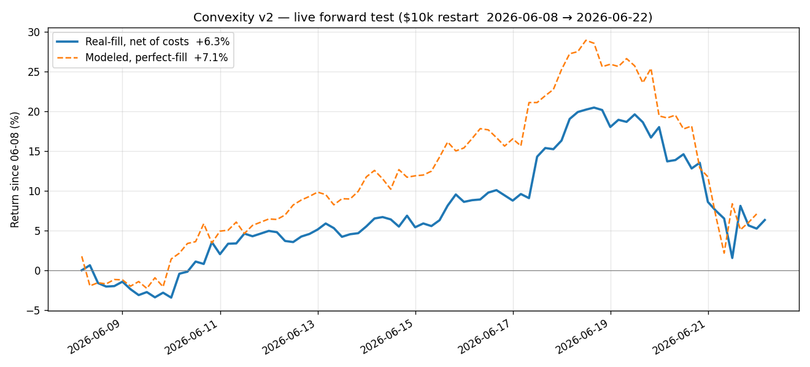

# Convexity v2 — Live Forward-Test Report

**As of 2026-06-22 07:00 UTC.** Market-neutral long/short on Binance USDM perps,
frozen 5.29 LGBM models, 6 overlapping 4h sleeves. Binance-train → Hyperliquid-execute
paper test. Two tracks: **modeled** (perfect-fill backtest from the 5.29 training cutoff)
and **real-fill** (real HL execution prices, fresh $10k ledger since 2026-06-08).



---

## 1. Headline P&L

| Track | Window | Cycles | Return | Sharpe | maxDD |
|---|---|---|---|---|---|
| **Real-fill (net of costs)** | 06-08 → 06-22 (14d) | 85 | **+6.32%** ($10,632) | — | −15.7% |
| Modeled, same window | 06-08 → 06-22 | 84 | +7.08% | — | — |
| **Modeled OOS** | since 5.29 (24d) | 145 | **+19.0%** | 3.71 | −20.8% |
| Modeled, full history | since 3-03 | 574 | +237.5% | 9.27 | −20.8% |

- **Real tracks modeled within 0.76%** over the live window (+6.32% vs +7.08%) → execution is faithful, not bleeding.
- Real-fill split: **+7.12% locked + −0.80% open** (10 positions held). Peak **+20.5%** (06-19), trough **−3.45%** (06-10).
- The bot's "perfect-fill +12.52%" line is *zero-cost gross* (upper bound); the modeled +7.08% is the right apples-to-apples benchmark since it already nets a cost assumption.

### Equity path (real-fill, daily 00:00)
```
06-09  -1.44%   06-13  +5.11%   06-17  +8.76%   06-21  +8.59%
06-10  -3.45%   06-14  +5.52%   06-18 +16.31%   06-22  +5.23%
06-11  +2.02%   06-15  +5.40%   06-19 +18.02%
06-12  +4.95%   06-16  +8.60%   06-20 +18.00%
```
Recovered from the −3.45% trough, rallied to +18%, then a sharp −13pt pullback on 06-21/22.

---

## 2. Regime & alpha (the strategy's real signal)

The test ran in a **bear-dominated tape** (117 of 145 OOS cycles `bear`, 28 `side`, 0 `bull`).

| Regime | Cycles | Cum | Sharpe | maxDD | Win |
|---|---|---|---|---|---|
| side | 28 | +14.9% | 20.6 | −2.7% | 68% |
| bear | 117 | +3.5% | 1.20 | −20.8% | 56% |

- **Pick alpha (OOS, 118 logged cycles): long +10.1 bps, short +2.5 bps** — both positive; the model's selection is additive over the full OOS.
- **But the edge is regime-skewed and the recent stretch is rough:** last 7d **−4.3%**, last 3d **−15.0%** (Sharpe −15, win 39%) — a concentrated drawdown that ate the +18% peak back to +5%.
- All bear drawdowns run unprotected by design (`STOP_SKIP_REGIMES=bear`).

---

## 3. Execution / orderbook quality (637 legs, 98 cycles)

| Metric | Value |
|---|---|
| Fill rate | **100%** (0 unfilled) |
| Slippage vs HL mid | mean **7.0 bps**, med 5.5, p90 14, p99 27, max 58 |
| Spread | mean 7.2 bps |
| Total cost / leg | **11.5 bps** (book-slip 5.6 + latency 0.6 + fee 4.5 + basis −0.8) |
| Decision→fill latency | ~26 s |
| Avg leg notional | $2,908 · avg gross ~$20k (≈2× equity) · ~34% turnover/cycle |
| By side | buy 6.1 bps, sell 7.9 bps |

**Worst-slippage names** (the cost concentration — illiquid micro-caps):
`MOVE 20.3 · TNSR 18.2 · MEME 13.8 · SUPER 11.6 · SOPH 11.5 · ME 11.0` bps.

---

## 4. Operations & data integrity

- **Collector uptime 316h (13 days), zero restarts** since the 06-09 fix-deploy. (PID 4448.)
- **Cadence clean** for the live period — the 93 "missing" 4h cells on the grid are all pre-test early-May historical gaps, not live.
- **Backfills back to ~4s** (the merge-on-flush fix holds): only a few isolated slow cycles, no all-day 89s cascades like 06-08.
- Data health typical: 173/174 gapless per cycle (the 1 is VINE, a frozen non-traded xs-rank peer, FAPI-refreshed).
- 4 tmux sessions live (cycle runner, monitor, + the separate funding session).

---

## 5. Issues found & fixed during the test

| Date | Issue | Fix | Status |
|---|---|---|---|
| 06-09 | Collector flush **overwrote** day-files, re-dropping FAPI backfills → all-day 89s slow cycles | merge-on-flush (`0320f1d`) | ✅ holding |
| 06-10 | Real-fill executor never reconciled → **orphan positions** drifting (ASTER) | reconcile held↔intended each cycle (`7f2dc99`) | ✅ **0 stray / 0 missing now** |
| 06-10 | `cycles.csv` catch-up path logged **NaN alpha** (27 cycles) | add attribution to settle path (`4d55ecc`) | ✅ logging clean |

Root cause of the 06-08 slow cycles was traced to a **collector restart straddling a 5m close** (my own fix-deploy restart), amplified by the overwrite-clobber — both now fixed.

---

## 6. Assessment

- **System: healthy and stable.** Faithful execution (real ≈ modeled), 100% fills, clean data, no orphan drift.
- **Strategy: net positive (+6.3% real / +19% modeled OOS) through a bear-dominated, volatile test**, but the edge is concentrated in `side` regimes and the book runs **high per-cycle variance** (2-long/2-short sleeves → ±3–5% cycles). The recent 3-day −15% drawdown shows the tail risk.
- **Watch-items:** (1) micro-cap slippage (MOVE/MEME/TNSR) — a liquidity/size cap would help; (2) no drawdown stop in bear; (3) the long leg historically inverts in deep bear (recovered this window, but fragile).

---

## 7. Root-cause: the −15% drawdown (06-18 → 06-22)

**It was a cross-sectional alpha reversal, not a market move.** BTC was flat (**−0.7%** over the 4 days), the book's **net beta was −4 bps** (fully hedged), and of the **−1550 bps** total loss, **−1525 bps was alpha** (selection) — both legs' picks reverted: longs faded, shorts squeezed.

**Concentrated in a few recurring micro-cap names** (moves verified from klines):

| name | role | picks / 18 cyc | move 06-18→06-22 | book impact |
|---|---|---|---|---|
| **TNSR** | short | 6 | **+78% peak / +55% net** | **−3,957 bps** |
| **ME** | short | **12** | **+65% peak / +39% net** | −1,439 bps |
| HYPE | long | 8 | +2.8% peak / **−7.6% net** | −688 bps (−1051 α) |
| NXPC | long | 5 | −8.4% | −422 bps |
| XLM | long | 3 | −6.5% | −362 bps |

**Concentration was the amplifier.** `ME` was shorted in **12 of 18 cycles** → it sat in ~4 of the 6 active sleeves at once, so its +39% squeeze bled every sleeve simultaneously. The 2-name-per-sleeve design + recurring high-conviction picks let a handful of names dominate the whole book.

**Unifying theme:** these are the *same illiquid micro-caps that top the slippage table* (TNSR, ME, MOVE, MEME). Illiquid low-cap exposure is hurting on **both axes — execution cost and tail risk** (unbounded short-squeeze risk + violent mean-reversion). The system executed a correct beta-neutral book; the *signal* concentrated into the most dangerous corner of the universe.

---

## 8. Proposed tests (for the backtest server — OOS replay, off the live box)

Baseline = current config: `BEAR_MODE=equal BEAR_K=2 SIZING_MODE=inv_vol LONG_MAX_RET3D=0.20`.
Selection lives in `convexity_paper_bot.py::select_legs`; sweep over the OOS window (since 5.29) and report **Sharpe, maxDD, the 06-18→06-22 drawdown magnitude, turnover, and a slippage proxy (avg leg ADV%)**.

1. **Liquidity / ADV floor** — exclude (or hard-cap weight on) symbols below an ADV threshold (e.g. trailing-7d quote-volume percentile, sweep 10/25/40th pct, or a hard $ floor). *Hypothesis: removes TNSR/ME/MOVE/MEME — trims both the squeeze tail and slippage.* Watch for edge loss if too aggressive.
2. **Per-name concentration cap** — limit a symbol's net weight across all active sleeves (e.g. ≤ 1 sleeve, or ≤ X% of gross). *Hypothesis: caps the ME-in-4-sleeves amplifier; should shrink the drawdown tail without much mean-return cost.*
3. **Asymmetric short cap** — apply a tighter liquidity floor / size cap to shorts than longs (shorts carry unbounded squeeze risk). *Hypothesis: cuts the short_alpha left tail (the TNSR/ME squeezes) while keeping the long book intact.*

**Success metric:** how much of the −15% / 3-day (and −20.8% maxDD) each lever would have trimmed, at what cost to OOS Sharpe/return. Compare against the +19.0% OOS baseline.

*Report generated 2026-06-22; numbers from the live `convexity_v2` state (real-fill ledger + cycles.csv + decide_slip.csv).*
